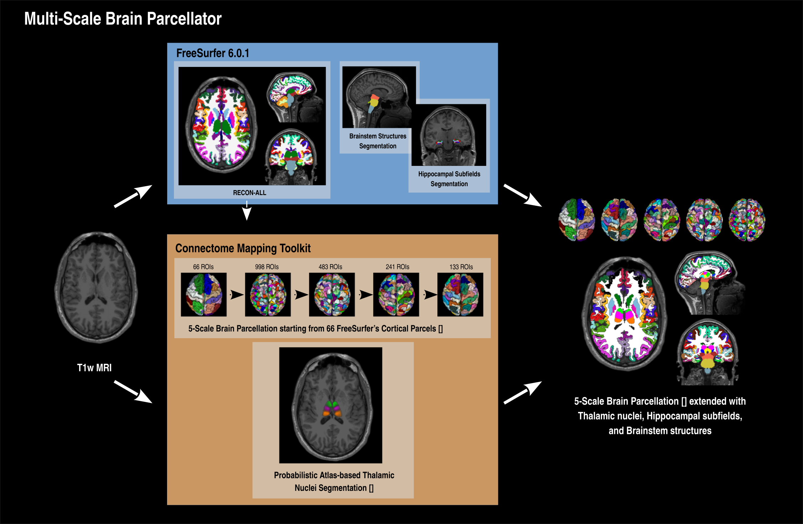

## Multi-Scale Brain Parcellator
This pipeline is developed by the Hagmann’s group at the University Hospital of Lausanne (CHUV) for use within the SNF Sinergia Project 170873 (), as well as for open-source software distribution.

### About
The Multi-Scale Brain Parcellator is a BIDS App that implements a full anatomical MRI processing pipeline interfacing with FreeSurfer 6.0.1, FSLMATHS (FSL 5.0.9), ANTs 2.2.0 and the Connectome Mapping Toolkit (CMTK), from raw T1w data to structural brain parcellation at five different scales.

### License
This software is distributed under the open-source license Modified BSD. See [license](LICENSE) for more details.

### Aknowledgments

If your are using the Multi-Scale Brain Parcellator in your work, please acknowledge this software and its dependencies. An example of citation could be:

> Results included in this manuscript come from the Multi-Scale Brain Parcellator version latest [1], a Nipype [2,3] based tool encapsulated in a BIDS app [4]. Resampling to isotropic resolution, Desikan-Killiany brain parcellation [5], brainstem parcellation [6], and hippocampal subfields segmentation [7] were performed using FreeSurfer 6.0.1. Final parcellations were created by performing cortical brain parcellation on at 5 different scales [8], probabilistic atlas-based segmentation of the thalamic nuclei [9],and combination of all segmented structures, using CMTK v3.0.0 [10] and the antsRegistrationSyNQuick of ANTS v2.2.0 [11].

> [1] 

> [2] 

> [3] 

> [4] 

> [5] 

> [6] 

> [7] 

> [8] 

> [9] 

> [10] 

> [11] 

### Usage
This App has the following command line arguments:

        $ docker -ti --rm sebastientourbier/multiscalebrainparcellator --help

        usage: multiscalebrainparcellator_bidsapp_entrypointscript [-h]
                                        [--participant_label PARTICIPANT_LABEL [PARTICIPANT_LABEL ...]]
                                        [--thalamic_nuclei]
                                        [--hippocampal_subfields]
                                        [--brainstem_structures]
                                        [-v]
                                        bids_dir output_dir {participant,group}

        Multi-scale Brain Parcellator BIDS App entrypoint script.

        positional arguments:
          bids_dir              The directory with the input dataset formatted
                                according to the BIDS standard.
          output_dir            The directory where the output files should be stored.
                                If you are running group level analysis this folder
                                should be prepopulated with the results of
                                theparticipant level analysis.
          {participant,group}   Level of the analysis that will be performed. Multiple
                                participant level analyses can be run independently
                                (in parallel) using the same output_dir.

        optional arguments:
          -h, --help            show this help message and exit
          --participant_label PARTICIPANT_LABEL [PARTICIPANT_LABEL ...]
                                The label(s) of the participant(s) that should be
                                analyzed. The label corresponds to
                                sub-<participant_label> from the BIDS spec (so it does
                                not include "sub-"). If this parameter is not provided
                                all subjects should be analyzed. Multiple participants
                                can be specified with a space separated list.
          --thalamic_nuclei     Segment thalamic thalamic_nuclei
          --hippocampal_subfields Segment hippocampal subfields (FreeSurfer)
          --brainstem_structures Segment brainstem structures (FreeSurfer)
          -v, --version         show program's version number and exit

#### Participant level
To run it in participant level mode (for one participant):

        docker run -it --rm \
        -v /home/localadmin/data/ds001:/bids_dataset \
        -v /media/localadmin/data/ds001/derivatives:/bids_dataset/derivatives \
        -v /usr/local/freesurfer/license.txt:/opt/freesurfer/license.txt \
        sebastientourbier/multiscalebrainparcellator:latest \
        /bids_dataset /bids_dataset/derivatives participant --participant_label 01 \
        --thalamic_nuclei \
        --hippocampal_subfields \
        --brainstem_structures

### Credits
* Patric Hagmann (pahagman)
* Sebastien Tourbier (sebastientourbier)
* Yasser Aleman (yasseraleman)
* Alessandra Griffa (agriffa)

### Funding
Work supported by the [Sinergia SNF-170873 Grant](http://p3.snf.ch/Project-170873).

### Copyright
Copyright (C) 2009-2019, Brain Communication Pathways Sinergia Consortium and the Multi Scale Brain Parcellator developers, Switzerland.
