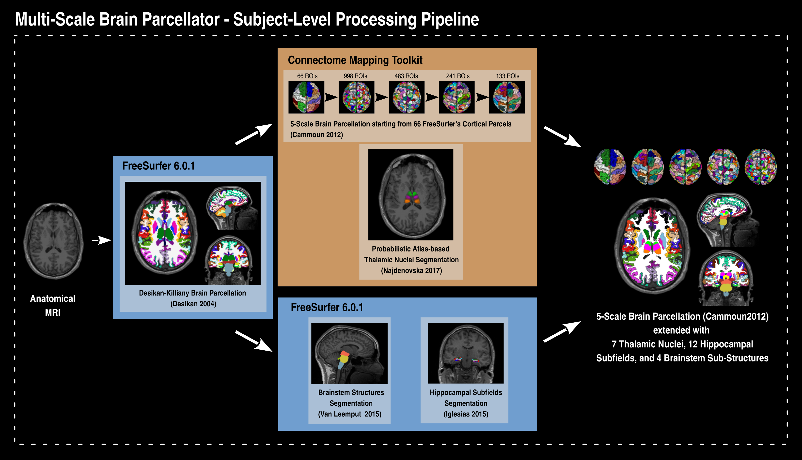

Multi-Scale Brain Parcellator
=======================================================

This pipeline is developed by the Hagmann’s group at the University Hospital of Lausanne (CHUV) for use within the `SNF Sinergia Project 170873 <http://p3.snf.ch/project-170873>`_, as well as for open-source software distribution.

.. image:: https://zenodo.org/badge/DOI/10.5281/zenodo.2536778.svg
   :target: https://doi.org/10.5281/zenodo.2536778
   :alt: Digital Object Identifier (DOI)

.. image:: https://circleci.com/gh/sebastientourbier/multiscalebrainparcellator/tree/master.svg?style=shield
  :target: https://circleci.com/gh/sebastientourbier/multiscalebrainparcellator/tree/master
  :alt: Continuous Integration Status

.. image:: https://readthedocs.org/projects/multiscalebrainparcellator/badge/?version=latest
  :target: https://multiscalebrainparcellator.readthedocs.io/en/latest/?badge=latest
  :alt: Documentation Status

*********
About
*********

``Multi-Scale Brain Parcellator``, part of the Connectome Mapping Toolkit (CMTK), is a BIDS App that implements a full anatomical MRI processing pipeline, from raw T1w data to structural brain parcellation at five different scales.

The ``Multi-Scale Brain Parcellator`` pipelines uses a combination of tools from well-known software packages, including FSL_, FreeSurfer_, ANTs_ as well as in-house tools from CMTK.

This tool allows you to easily do the following:

- Take T1 from raw to brain parcellations at 5 different scales.
- Implement tools from different software packages.
- Automate and parallelize processing steps, which provides a significant
  speed-up from typical linear, manual processing.

Reproducibility and replicatibility are promoted through the distribution of a BIDSApp, a software container image which provide a frozen environment where versions of all external softwares and libraries are fixed.

.. _FSL: https://fsl.fmrib.ox.ac.uk/fsl/fslwiki

.. _FreeSurfer: https://surfer.nmr.mgh.harvard.edu/fswiki/FreeSurferWiki

.. _ANTs: http://stnava.github.io/ANTs/

*********
Funding
*********

Work supported by the SNF Sinergia Grant 170873 (http://p3.snf.ch/Project-170873).

*******************
License information
*******************

This software is distributed under the open-source license Modified BSD. See :ref:`license <LICENSE>` for more details.

All trademarks referenced herein are property of their respective holders.

Copyright (C) 2009-2019, Brain Communication Pathways Sinergia Consortium, Switzerland.

********
Contents
********

.. _getting_started:

.. toctree::
   :maxdepth: 2
   :caption: Getting started

   installation

.. _user-docs:

.. toctree::
   :maxdepth: 2
   :caption: User Documentation

   usage
   workflow
   outputs

.. _about-docs:

.. toctree::
   :maxdepth: 1
   :caption: About Connectome Mapper

   LICENSE
   citing
   contributing
