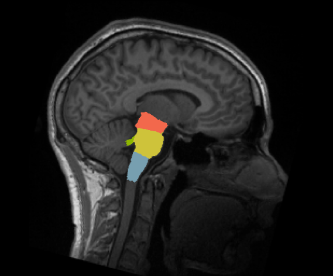
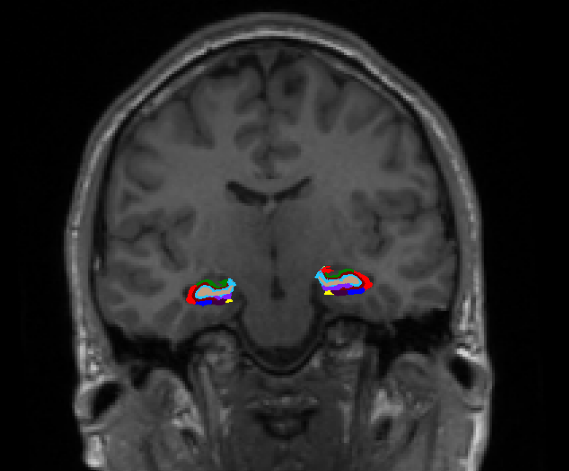
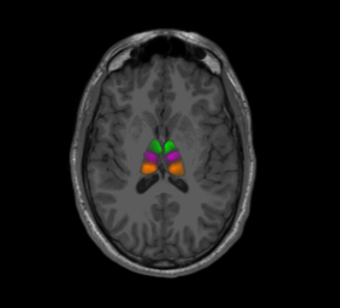
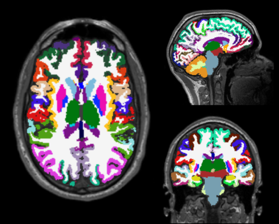

****************************
Processing Pipeline Details
****************************

Workflow
==============

The ``Multi-Scale Brain Parcellator`` pipelines uses a combination of tools from the well-known software packages FSL_, FreeSurfer_, ANTs_ as well as in-house tools from the Connectome Mapping ToolKit (CMTK).

.. image:: images/multiscalebrainparcellator.png
	:width: 888
	:align: center

Segmentation
==============

Surfaces are extracted using Freesurfer.

.. image:: images/ex_segmentation1.png
	:width: 600

T1 is segmented using Freesurfer.

.. image:: images/ex_segmentation2.png
	:width: 600

Brainstem sub-structures are segmented using Freesurfer.

Hippocampal subfields are segmented using Freesurfer.

Thalamic nuclei are segmented using an in-house tool of CMTK which implement the probabilistic atlas-based thalamic segmentation method with the help of ANTs (See Najdenovska 2018 in Citing Section).

Parcellation
------------

Desikan-Killiany brain parcellation is performed using Freesurfer.

5-Scale Brain parcellation is created according to Cammoun et al. 2012 (See ``Citing``) at 5 different scales.
All structures are then combined to create the final brain parcellation at each scale.

.. image:: images/multiscaleparcellation.png
	:width: 600
